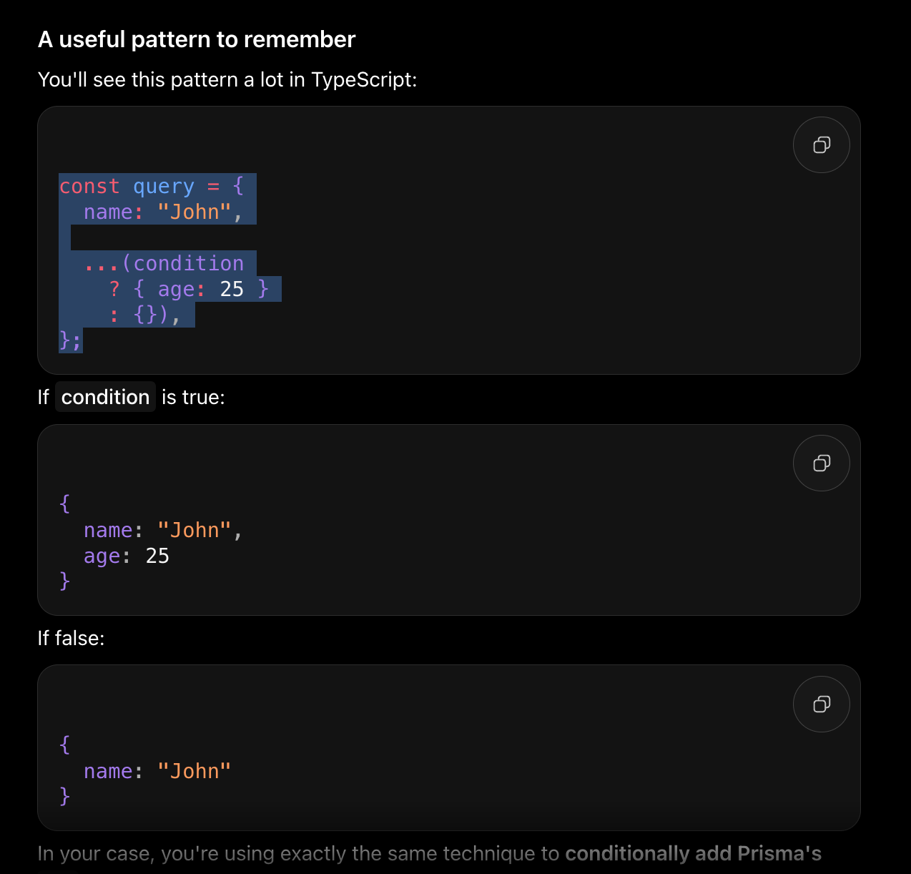

# it is full stack real time customer support platform

authentication

post /auth/signup
post /auth/login
get /auth/me 

conversation

post /conversation
get /conservation/:id
post /conversation/:id/assign
post /conversation/:id/close

get /admin/analytics
 

candidate api
post /supportconversation

user
conversations

Role -> Candidate, SuperVisor, Agent 
        

/**
Request A → findFirst() → nothing found
Request B → findFirst() → nothing found
Request A → create()
Request B → create()

Now the candidate has two open conversations.

If your requirement is strictly one open conversation per candidate, enforce that at the database level too.
**/

-------

Yes — a partial unique index is a database-level unique constraint that only applies to rows matching a condition.

For example, suppose you have:

users
-----
id
email
deletedAt

You want email to be unique only for active users, while allowing duplicate emails among soft-deleted users.

A partial unique index in PostgreSQL would be:

CREATE UNIQUE INDEX "users_email_active_unique"
ON "users" ("email")
WHERE "deletedAt" IS NULL;

So these are allowed:

email	     deletedAt
a@test.com	  NULL
a@test.com	  2026-01-01

But this is not allowed:

email	        deletedAt
a@test.com	    NULL
a@test.com	    NULL

Can Prisma define this?
Historically, Prisma did not have native schema syntax for partial indexes, so the usual approach was to create it in a Prisma migration manually.

For example:

npx prisma migrate dev --name add_active_email_unique --create-only

Then edit the generated migration.sql:

CREATE UNIQUE INDEX "users_email_active_unique"
ON "users" ("email")
WHERE "deletedAt" IS NULL;

And then apply the migration.

Your schema.prisma might still contain:

model User {
  id        Int       @id @default(autoincrement())
  email     String
  deletedAt DateTime?
}

You wouldn't represent the partial condition with @unique, because:

email String @unique

would make the email unique across all rows, including soft-deleted ones.

If you're using PostgreSQL + Prisma, I can also show you the recommended Prisma setup for soft delete + partial unique indexes, including what happens when prisma migrate dev runs again.

